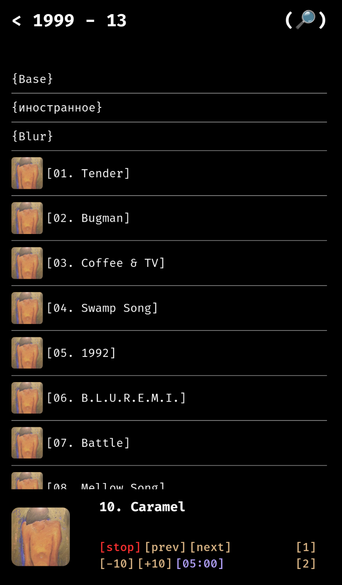

# Music Player

музыкальный плеер в том виде, котором я его представляю.  
Пока всё ориентировано только на размеры экрана телефона

## Как выглядит

  

## Быстрый запуск

1. Помещаете музыку в `audio/`
2. Создаете виртуальное окружение python с зависимостями из `requirements.txt`
3. Будучи в этом виртуальном окружении запускаете скрипт обновления базы музыки `sh update.sh`
4. Открываете в браузере или эмуляторе `index.html` и слушаете музыку (например на android `Local HTML Viewer` на iphone `HTML Viewer Q`)

## Принцип работы

В `files.js` хранится словарь, представляющий из себя дерево разделов в разделах и музыкальных файлов, начиная с `audio/`.  
При отображении папок и музыки с помощью `music.js` в плеере используются названия треков их картинки из директории `img/`, она полностью повторяет `audio/`, но вместо музыкальных файлов на их местах лежат их обложки, если обложки не будет то не будет и файла, отобразится лишь `null_track.png`. Данное разделение потребовалось из-за невозможности взаимодействия страницы с метаданными музыкальных файлов, по крайней мере у меня не получилось, если что всегда есть раздел issue, буду рад любой помощи и идеям.  
Также реализован поиск треков по всему плееру с помощью значка лупы в правом верхнем углу, реализован в `search.js`

## Итог

По итогу:  

1. `music.js` отвечает за отображение треков и разделов в обычном режиме, а также воспроизведение музыки (включение трека, переход к следующему/предыдущему)
2. `search.js` отвечает за раздел поиска треков по всему плееру (пока что только по всему), просто обход дерева
3. `pleer.js` отвечает за работоспособность панели воспроизведение внизу плеера
4. `files.js` словарь-дерево разделов в разделах и музыкальных файлов, начиная с `audio/`
5. `old_files.js` прошлый `files.js`, на случай утери или повреждения нынешнего (музыку слушать то хочется во время восстановления)
6. `scripts/` содержит скрипты для сборки `files.js` и `img/`, написан на python потому что удобно

Плеер достаточно удобен, сам постоянно им пользуюсь (+-всегда)  
(прикольно что в моем случае **files.js** насчитывает около 300000 символов) )
